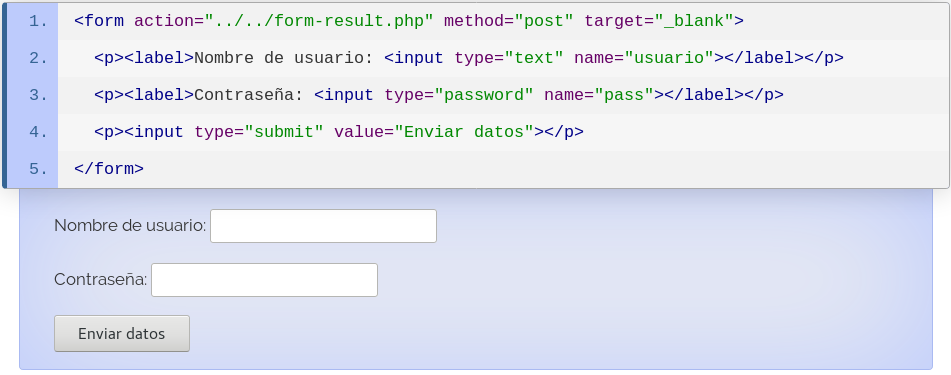
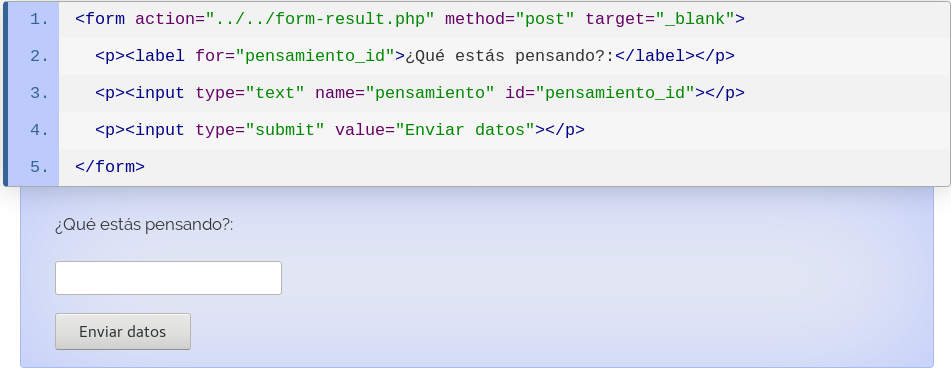
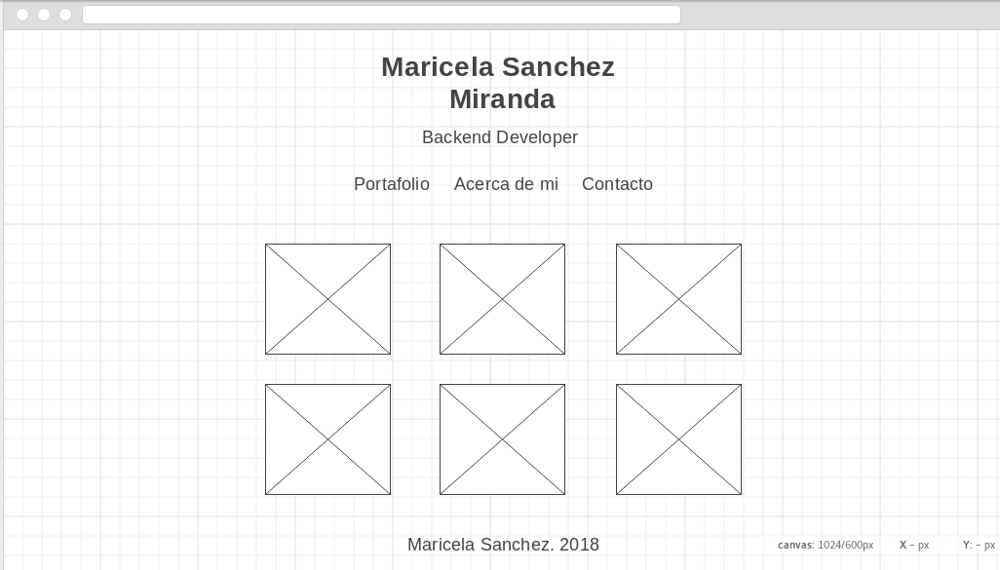
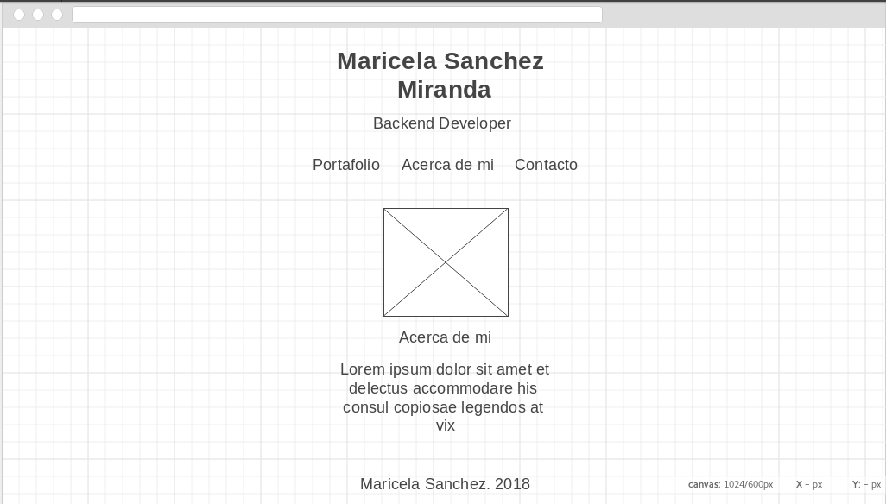
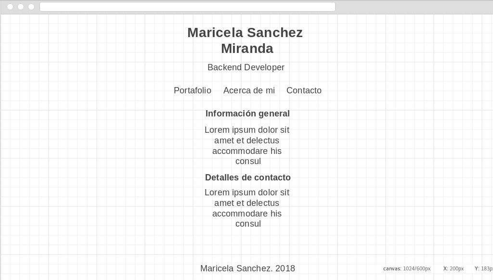

# Fundamentos de HTML

HTML es un lenguaje de marcado y es usado para decirle al navegador que desplegar al visitar una página web. Consiste en una serie de etiquetas que representan elementos que usas para _marcar_ diferentes partes del contenido, dicho de otra manera, las etiquetas son los bloques que conforman u página web.
Una página web es una serie de elementos HTML anidados.

## Versiones de HTML

| Versión | Año |
| --- | --- |
| HTML | 1991 |
| HTML 2.0 | 1995 |
| HTML 3.0 | 1997 |
| HTML 4.0 | 1999 |
| XHTML | 2000 |
| HTML5 | 2014 |


## Estructura básica de un documento HTML

```html
<!DOCTYPE html>
<html>
  <head>
    <!-- Dentro de esta etiqueta se encuentran meta datos del documento en si-->
  </head>
  <body>
    <!-- Etiquetas que definen el contenido que el usuario verá-->
  </body>
</html> 
```


## Composición de una etiqueta HTML

La composición general de una etiqueta se da de la siguiente manera:

```html
<etiqueta atributo1="valor1" atributo2="valor2">Contenido</etiqueta>
```


Aunque para algunos elementos, llamados _elementos vacíos_, la composición cambia a:

```html
<etiqueta atributo1="valor1" atributo2="valor2">
```

Como podrán observar la etiqueta no tiene cierre, esto es por que no _encapsula_ ningún contenido.

### Tipo de elementos de marcado

1. Elementos de marcado de estructura: Indican el propósito del contenido. Estos elementos no denotan ningún render en especial. Ejemplo \<h2>Subtítulo\</h2>.
2. Elementos de marcado de presentación: Indican la apariencia del contenido sin importar el contenido en si mismo. Ejemplo \<b>Hola Mundo\</b>.
3. Elementos de marcado de hipertexto: Indican partes de un documento que se dirigen a otros documentos. Ejemplo, \<a href="https:www.google.com">Google\</a>.

### Atributos

La mayoría de los atributos son pares nombrados separados por un signo de =. Añaden información adicional a los elementos HTML, siempre son colocados en la etiqueta de apretura. Los atributos más usados son los siguientes:

* id: Define un identificador único para el elemento dentro del documento HTML.
* class: Provee una forma de clasificar elementos.
* href: usado en la etiqueta _a_ para definir un enlace a otro documento.
* src: usado en la etiqueta _img_ para definir la ruta de la imagen a utilizar.
* disabled: especifica que un elemento está deshabilitado.


## Etiquetas


### Etiquetas descontinuadas

|Etiqueta | Descripción |
|--- | ---|
|\<acronym> | Define un acrónimo|
|\<applet> | Define un applet |
|\<basefont> | Define un fuente base para la página |
|\<big> | Define texto grande |
|\<center> | Define texto centrado |
|\<dir> | Define una lista de un directorio |
|\<font> | Define text font, size, and color |
|\<frame> | Define un frame |
|\<frameset> | Define un conjunto de frames |
|\<isindex> | Define un campo input |
|\<noframes> | Define una sección no frame |

### Etiquetas activas

#### Etiqueta _head_

El elemento _head_ es un contenedor para los metadatos. Los metadatos no son desplegados el usuario. Las etiquetas siguientes definen metadatos:

| Etiqueta| Descripción |
|--- | ---|
| title| Indica el título del documento.Sus etiquetas son: <title> y </title> (ambas obligatorias). Crea una caja: Está definido como: Elemento de contenido de cabecera.|           
| style | Es el elemento encargado de indicar la información de estilos. |
| meta |Son tipicamente usados para especificar la descripcion de la pagina, teclado , autor del documento, ultima modificacion y otros metadatos,los metadatos no seran mostrados en la pagina, pero la maquina lo analiza|
| link |
| script| El elemento HTML Script (<script>) se utiliza para insertar o hacer referencia a un script ejecutable dentro de un documento HTML o XHTML.|
| base | Especifica la dirección URL base que se utilizará para todas las direcciones URL relativas contenidas dentro de un documento. Sólo puede haber un elemento <base> en un documento.|

#### Encabezados

* \<h1>Encabezado 1\</h1>
* \<h2>Encabezado 2\</h2>
* \<h3>Encabezado 3\</h3>
* \<h4>Encabezado 4\</h4>

* \<h5>Encabezado 5\</h5>
* \<h6>Encabezado 6\</h6>

Los motores de búsqueda usan los encabezados para indexar la estructura y contenido de tu página web. Para aplicar estilos a los encabezados usa CSS.

#### Párrafos

* \<p>Define un párrafo\</p>
* \<br> Inserts a single line break
* \<pre>Define un texto preformateado\</pre>

#### Etiquetas para definir secciones de contenido

* _div_
* _section_
* _footer_
* _header_

#### Etiquetas para definir elementos multimedia

* _img_
* _audio_
* _video_
* _canvas_
* _svg_

#### Etiquetas para formulario

* _form_
* _label_
* _input_

##### Form

El elemento _form_ que define un formulario puede tener atributos entre los que destacan:

* _action_: Define la acción a realizar cuando el formulario sea enviado. Si el atributo no es definido entonces la acción se establece a la página actual.
* _target_: Especifica si el resultado enviado debe de abrirse en una nueva página o en la página actual.
* _method_: Especifica el método HTTP que será usado para enviar los datos del formulario.

> * El método por default es GET, sin embargo cuando este método es usado los datos del formulario son visibles en la barra de dirección.
> * La longitud máxima de una URL es de 300 caracteres.
> * Nunca uses GET para datos sensibles.
> * GET es bueno para datos no sensibles, como los _query params_ en una búsqueda.

##### Label

El elemento label representa una etiqueta que puede ser asociada a un control de formulario, y que se supone provee una descripción corta para éste. Los navegadores pueden enlazar ambos elementos permitiendo que los usuarios establezcan el enfoque sobre el control al hacer clic en su etiqueta.

Existen dos formas de asociar a un elemento label con un control: insertando al texto de la etiqueta y al control dentro de label; o haciendo que coincidan los valores del atributo id en el control y del atributo for en label.





##### Input

###### Tipos de elemento input

|Tipo | Descripción |
| --- | --- |
| button| Crea un botón en el que se puede hacer click sin ningún valor por defecto. |
| checkbox| Permite insertar un vector o arrray de valores. |
| color| Permite al usuario seleccionar un color.  |
| date| Permite al usuario proporcionar una fecha. |
| datetime| Permite ingresar hora y fecha (hora, minuto, segundo, fracción de segundo) basado en la zona horaria UTC. |
| datetime-local | Se escoge una fecha y hora sin la zona horaria  |
| email|el tipo de entrada tiene que ser un email |
| file|define un campo de archivo y lo selecciona y pone un boton para ver los archivos subidos|
| hidden|oculta un campo de entrada de datos al usuario aunque la informacion es enviada cuando el formulario es presentada  |
| image|el tipo de entrada es una imagen y envia coordenadas X y Y del clic que activo el boton de imagen|
| month|  En un atribtuo type, representa un campo para la entrada de un mes. En los navegadores que soportan el mecanismo, estos campos pueden estar representados por controles que permiten a los usuarios cambiar su valor de manera gráfica (como, por ejemplo, un calendario), en lugar de tener que ingresarlo directamente como una cadena.|
| number| Este elemento valida automáticamente que los valores introducidos sean numéricos sin necesidad de scripts adicionales, toda la validación la realiza el propio navegador|
| password|El buscador generará un campo para escribir, y cambiar la contraseña. Los datos que introduzca el usuario serán mostrardos como asteriscos, estos carácteres puede variar dependiendo del buscador. |
| radio|En un atributo type, representa una opción que pertenece a un grupo en el que no más de una opción puede ser seleccionada al mismo tiempo. Estos grupos están normalmente conformados por un número de botones de opción, todos compartiendo el mismo valor en el atributo name. |
| range| permite que el usuario especifique un valor numérico comprendido entre un valor mínimo y máximo. El valor exacto, sin embargo, no se considera importante. Se repesenta típicamente como un "tirador" o un control deslizante en lugar de un campo de texto como otros tipos de <input>. Como este tipo de widget es bastante inmpreciso, no debe utilizarse normalmente a menos que el valor exacto del control no sea importante. |
| reset|Permite agregar un boton con la funcionalidad de limpiar cualquier formulario o valor asignado. |
| search|Permite agregar campos donde se podria recibir texto para busquedas. |
| submit| Permite agregar botones que al ser presionados intentan enviar los datos capturados en cualquier campo imput hacia el servidor. |
| tel| Permite agregar un campo que valida que se hayan introducido caracteres numericos cuando se requiera solicitar un numero telefonico. |
| text| Permite crear campos simples para captura de texto. |
| time | Define el control para ingresar una hora (sin zona horaria)|
| url |Define un campo para ingresar una URL|
| week | Define un control de semana y año (sin zona horaria)|


## Atributos globales

[](https://www.w3schools.com/tags/ref_standardattributes.asp)

## Atributos de eventos

[](https://www.w3schools.com/tags/ref_eventattributes.asp)

## Maquetación WEB

La maquetación web es el proceso en el que el prototipo gráfico también denominado «layout» (con los requisitos estructurales y estéticos definidos y aprobados en un análisis inicial) pasa a transformase en código html, css y js (estándares web) para que los navegadores puedan interpretarlo correctamente.

## Proyecto: Portafolio

Crearemos un portafolio para búsqueda laboral, empezaremos primero creando los _wire frames_ de nuestra página web.

La página de galería será donde mostremos los proyectos más importantes que hemos realizado.



A continuación la página donde hablamos un poco más sobre nosotros.



Finalmente la página donde mostraremos nuestros datos de contacto.




## Referencias

* https://www.w3schools.com/html/html_forms.asp
* https://www.tutorialspoint.com/html5/html5_deprecated_tags.htm
* https://developer.mozilla.org/es/docs/Learn/Getting_started_with_the_web/HTML_basics
* https://en.wikipedia.org/wiki/HTML
* https://www.w3schools.com/html/html5_semantic_elements.asp
* https://www.tutorialspoint.com/html5/html5_new_tags.htm
* https://developer.mozilla.org/es/docs/Web/HTML/Elemento/input
* https://www.fundeu.es/escribireninternet/edicion-y-maquetacion-de-documentos-web/
* http://htmlcheatsheet.com/
* 


